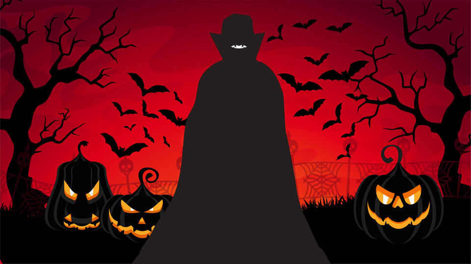

**1. Which text did you choose? Who wrote it? When? Where is it from?**  

I chose the poem Halloween Party by Kenn Nesbitt written in 2005. Source: When the Teacher Isn't Looking (2005)

Poem Link:  
[Halloween Party](https://www.poetryfoundation.org/poems/47155/halloween-party)

**2. How is the animation related to the text?**

The undulating text resembles a dance at the Halloween party. Nesbitt recounted his costume as that of a Dracula with jet-black hair. Thus, the dancing black lines mirror the darkness of that hair. Coupled with a color palette of red, black, and white, it evokes the Dracula.  

Moreover, Halloween is steeped in enigma; initially, viewers don't see the entirety of the poem. As the mouse shifts from left to right, they unveil the concealed words beneath the shroud of mystery.

**3. What were some of the challenges when implementing this exercise?**  

First, when I preload the poem, there are commas between each sentence. Later, I learned to use join() to fix it.  

Second, text(str, x, y, [x2], [y2]), [x2] [y2] doesn’t work to set the width and height for the text box on line 84. Later I use if() to check if the x-coordinate exceeds a threshold and reset it, and then move down to the next row.  

The biggest challenge is to select words to create the wavy effect. It takes a long time to figure out how to select a random word and add it to the list of selected words.  

**4. Include drawings and images of reference visualizations**
 

